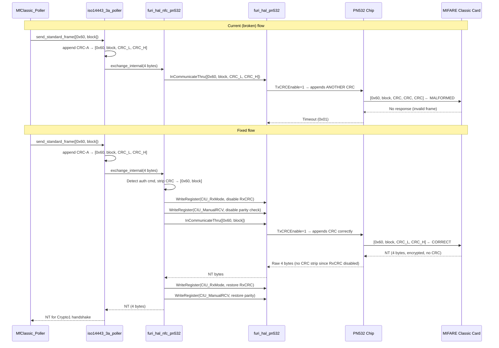

# Design Document: NFC PN532 MIFARE Classic Auth Fix

## Overview

This design addresses the root cause of MIFARE Classic authentication failure on the DIY Flipper Zero's PN532 module. The PN532 clone module's native `InDataExchange` auth (0x60/0x61) returns error 0x14 for all keys. The fallback path via `InCommunicateThru` times out because of two compounding framing errors:

1. **Double CRC**: The ISO14443-3A layer appends software CRC-A to the auth command before it reaches `exchange_internal()`. The PN532's `InCommunicateThru` has `TxCRCEnable=1` by default, so it appends a second CRC. The card receives `[0x60, block, CRC, CRC, CRC]` — malformed.

2. **RX CRC validation on NT**: The PN532's `RxCRCEnable=1` causes it to validate CRC on the 4-byte NT response. MIFARE Classic auth responses are raw encrypted bytes with parity — no CRC. CRC validation fails, PN532 reports timeout (0x01).

The fix involves:
- Stripping software CRC before sending auth commands via `InCommunicateThru`
- Temporarily disabling `RxCRCEnable` (CIU register 0x6303 bit 2) for the auth exchange
- Disabling parity checking via `CIU_ManualRCV` for encrypted responses
- Restoring normal CRC/parity settings after auth completes
- Bypassing PN532 native auth entirely (compile-time flag)

Secondary fixes address MfUltralight CRC handling, emulate mode error reporting, and supported-card plugin timeout optimization.

## Architecture



### Design Decisions

1. **Strip CRC in `exchange_internal()` rather than in the poller layer**: The ISO14443-3A layer always appends CRC for standard frames. Modifying that behavior would break all other protocols. Instead, `exchange_internal()` strips the 2-byte CRC when it detects an auth command (0x60/0x61), since `InCommunicateThru` with `TxCRCEnable=1` will add the correct CRC.

2. **CIU register manipulation via `WriteRegister` (0x08)**: The PN532's `InCommunicateThru` uses the CIU (Contactless Interface Unit) registers directly. We use the existing `pn532_write_register()` helper to toggle `CIU_RxMode` and `CIU_ManualRCV` before/after auth. This is the same mechanism already used for `CIU_BitFraming` in `in_communicate_thru_bits()`.

3. **Bypass native auth entirely**: The PN532 clone module returns 0x14 for all keys. Rather than debugging the clone firmware, we disable native auth via a compile-time flag (`PN532_NATIVE_AUTH_DISABLED`). The Crypto1 fallback path (once fixed) handles all auth correctly.

4. **No short-frame (7-bit) framing for auth**: Despite ISO14443-3A specifying short frames for REQA/WUPA, the MIFARE Classic auth command is a standard frame (full bytes with CRC). The PN532 handles this correctly with `InCommunicateThru` — no `CIU_BitFraming` manipulation needed for the auth command itself.

5. **Parity disable for encrypted responses**: After the initial NT, all subsequent MIFARE Classic communication is encrypted with Crypto1. The PN532's automatic parity checking would fail on encrypted data. We disable parity via `CIU_ManualRCV` bit 4 for the auth exchange.

## Components and Interfaces

### Component 1: Auth CRC/Parity Manager (`furi_hal_pn532.c`)

**New public function:**

```c
/**
 * Configure PN532 CIU registers for MIFARE Classic auth exchange.
 * Disables RxCRC validation and automatic parity checking.
 * Must be called before InCommunicateThru auth, and restored after.
 */
FuriHalPn532Error furi_hal_pn532_mf_auth_configure_ciu(bool auth_mode);
```

**Registers manipulated:**
- `CIU_RxMode` (0x6303): Bit 2 = `RxCRCEn`. Set to 0 for auth (no CRC in NT response).
- `CIU_ManualRCV` (0x630D): Bit 4 = `ParityDisable`. Set to 1 for auth (encrypted parity).
- Both restored to defaults after auth completes or fails.

**Implementation:**
```c
#define PN532_REG_CIU_RxMode     0x6303
#define PN532_REG_CIU_ManualRCV  0x630D

/* Default values (PN532 power-on defaults for ISO14443A InCommunicateThru) */
#define PN532_CIU_RXMODE_DEFAULT    0x08  /* RxCRCEn=1, RxSpeed=106kbps */
#define PN532_CIU_RXMODE_NO_CRC     0x00  /* RxCRCEn=0, RxSpeed=106kbps */
#define PN532_CIU_MANUAL_RCV_DEFAULT 0x00 /* ParityDisable=0 (auto parity) */
#define PN532_CIU_MANUAL_RCV_NO_PAR  0x10 /* ParityDisable=1 */

FuriHalPn532Error furi_hal_pn532_mf_auth_configure_ciu(bool auth_mode) {
    if(auth_mode) {
        // Entering auth: disable RxCRC and parity
        if(!pn532_write_register(PN532_REG_CIU_RxMode, PN532_CIU_RXMODE_NO_CRC)) {
            return FuriHalPn532ErrorComm;
        }
        if(!pn532_write_register(PN532_REG_CIU_ManualRCV, PN532_CIU_MANUAL_RCV_NO_PAR)) {
            return FuriHalPn532ErrorComm;
        }
    } else {
        // Exiting auth: restore defaults
        pn532_write_register(PN532_REG_CIU_RxMode, PN532_CIU_RXMODE_DEFAULT);
        pn532_write_register(PN532_REG_CIU_ManualRCV, PN532_CIU_MANUAL_RCV_DEFAULT);
    }
    return FuriHalPn532ErrorNone;
}
```

### Component 2: Fixed Auth Interception (`furi_hal_nfc_pn532.c` — `exchange_internal()`)

**Modified auth path in `exchange_internal()`:**

```c
if(send_len >= 2U && (tx_bytes[0] == 0x60U || tx_bytes[0] == 0x61U)) {
    // Strip software CRC-A (last 2 bytes) — PN532 TxCRCEnable adds correct CRC
    size_t auth_len = 2; // Only [auth_cmd, block_num]
    
    // Configure CIU for auth (disable RxCRC + parity)
    FuriHalPn532Error ciu_err = furi_hal_pn532_mf_auth_configure_ciu(true);
    if(ciu_err != FuriHalPn532ErrorNone) {
        furi_hal_pn532_mf_auth_configure_ciu(false); // best-effort restore
        // ... error handling
    }
    
    // Send auth command without CRC (PN532 adds CRC via TxCRCEnable)
    err = furi_hal_pn532_in_communicate_thru_timeout(
        tx_bytes, auth_len, rx_payload, PN532_MAX_FRAME_SIZE, &rx_len,
        PN532_TIMEOUT_MF_AUTH_MS);
    
    // Restore CIU to normal mode
    furi_hal_pn532_mf_auth_configure_ciu(false);
    
    if(err == FuriHalPn532ErrorNone && rx_len == 4) {
        // NT received — pass raw bytes to Crypto1 engine
        furi_hal_nfc_pn532_prepare_rx(rx_payload, rx_len, false, true);
        furi_hal_nfc_pn532.mf_authed = true;
        // ...
    }
}
```

### Component 3: Native Auth Bypass (`mf_classic_poller_i.c`)

**Compile-time flag to disable native auth:**

```c
#ifndef PN532_NATIVE_AUTH_DISABLED
#define PN532_NATIVE_AUTH_DISABLED 1  // Disabled by default for clone modules
#endif

// In mf_classic_poller_auth_common():
#if !PN532_NATIVE_AUTH_DISABLED
        if(!is_nested && !backdoor_auth && !early_ret &&
           furi_hal_nfc_pn532_is_active()) {
            // ... native auth attempt ...
        }
#endif
```

### Component 4: Diagnostic Logging (`furi_hal_nfc_pn532.c`)

**Compile-time diagnostic flag:**

```c
#ifdef NFC_AUTH_DIAG
#define AUTH_DIAG_LOG(fmt, ...) FURI_LOG_I("AuthDiag", fmt, ##__VA_ARGS__)
#else
#define AUTH_DIAG_LOG(fmt, ...) do {} while(0)
#endif
```

Logs each auth stage: InListPassiveTarget result, CIU configuration, auth frame sent, response/timeout, Crypto1 handshake frames.

### Component 5: Emulate Mode Guard (`mf_classic.c`)

**Error message for unsupported emulation:**

```c
// In nfc_scene_emulate_on_enter() or equivalent:
if(furi_hal_nfc_pn532_is_active() && protocol == NfcProtocolMfClassic) {
    // Show popup: "MF Classic emulation not supported on PN532"
    return;
}
```

### Component 6: Plugin Timeout Optimization (`nfc_supported_cards.c`)

**Per-plugin and cumulative timeout enforcement:**

```c
#define SUPPORTED_CARD_PLUGIN_TIMEOUT_MS  2000  // 2s per plugin
#define SUPPORTED_CARD_TOTAL_TIMEOUT_MS   5000  // 5s total

// Track cumulative time across all plugin checks
uint32_t total_start = furi_get_tick();
for(size_t i = 0; i < plugin_count; i++) {
    if((furi_get_tick() - total_start) > SUPPORTED_CARD_TOTAL_TIMEOUT_MS) break;
    // ... run plugin with per-plugin timeout ...
}
```

## Data Models

### CIU Register State

No persistent data model needed. CIU registers are manipulated transiently during auth and restored immediately after. The state is implicit in the PN532 hardware.

### Auth Flow State (existing `FuriHalNfcPn532State`)

Existing fields used:
- `mf_authed` (bool): Whether PN532 considers auth active
- `needs_relist` (bool): Whether card needs re-polling before next command
- `target_tick` (uint32_t): Timestamp of last successful InListPassiveTarget

No new persistent fields required. The CIU configuration is purely transient (set before auth, restored after).

### Diagnostic Counters (compile-time only)

```c
#ifdef NFC_AUTH_DIAG
typedef struct {
    uint32_t native_auth_attempts;
    uint32_t native_auth_failures;
    uint32_t crypto1_auth_attempts;
    uint32_t crypto1_nt_received;
    uint32_t crypto1_timeouts;
    uint32_t ciu_config_failures;
    uint32_t relist_before_auth;
} NfcAuthDiagCounters;
#endif
```


## Correctness Properties

*A property is a characteristic or behavior that should hold true across all valid executions of a system — essentially, a formal statement about what the system should do. Properties serve as the bridge between human-readable specifications and machine-verifiable correctness guarantees.*

### Property 1: Auth Frame CRC Stripping

*For any* auth command byte (0x60 or 0x61) and *for any* block number (0x00–0xFF), when `exchange_internal()` receives a 4-byte frame [auth_cmd, block, CRC_L, CRC_H] from the ISO14443-3A layer, the frame passed to `InCommunicateThru` SHALL be exactly 2 bytes: [auth_cmd, block].

**Validates: Requirements 2.1, 2.2**

### Property 2: CIU Register Round-Trip

*For any* auth sequence (regardless of auth command, block number, or outcome — success, timeout, or communication error), the CIU registers `CIU_RxMode` and `CIU_ManualRCV` and `CIU_BitFraming` SHALL be restored to their default values after the auth exchange completes. Specifically:
- Before auth: `CIU_RxMode` is set to 0x00 (RxCRCEn=0), `CIU_ManualRCV` is set to 0x10 (ParityDisable=1), `CIU_BitFraming` is 0x00
- After auth (success or failure): `CIU_RxMode` is restored to 0x08, `CIU_ManualRCV` is restored to 0x00, `CIU_BitFraming` remains 0x00

**Validates: Requirements 2.3, 7.1, 7.2, 7.4**

### Property 3: NT Passthrough Integrity

*For any* 4-byte NT value received from `InCommunicateThru` after a successful auth command, the bytes delivered to the Crypto1 engine (via `prepare_rx`) SHALL be identical to the raw bytes received — no CRC stripping, no CRC appending, no byte reordering.

**Validates: Requirements 2.4, 7.3**

### Property 4: Deauth State Reset

*For any* call to `furi_hal_nfc_pn532_mf_deauth()`, regardless of the prior state of `mf_authed`, `needs_relist`, or `target_tick`, the function SHALL set `needs_relist = true`, `mf_authed = false`, and `target_tick = 0`.

**Validates: Requirements 3.1, 3.2**

### Property 5: Stale Target Detection

*For any* `target_tick` value, `exchange_internal()` SHALL trigger an `InListPassiveTarget` re-poll if and only if `target_tick == 0` OR `(current_tick - target_tick) > PN532_TARGET_FRESHNESS_TIMEOUT_MS`. After a successful re-poll, `target_tick` SHALL be updated to the current tick and `needs_relist` SHALL be false.

**Validates: Requirements 3.3, 3.4**

### Property 6: MfUltralight READ Response Length

*For any* MfUltralight READ command response received via `InCommunicateThru` where the raw response is 18 bytes (16 data + 2 CRC), the bytes delivered to the protocol layer SHALL be exactly 16 bytes (CRC stripped once, not double-stripped or double-appended).

**Validates: Requirements 4.2, 4.3**

## Error Handling

### Auth CIU Configuration Failure

If `pn532_write_register()` fails during CIU configuration for auth:
- Log the failure at WARN level
- Attempt best-effort restore of all registers
- Return `FuriHalPn532ErrorComm` to the caller
- The auth attempt is aborted; the poller will retry on the next sector

### InCommunicateThru Timeout During Auth

If `InCommunicateThru` returns timeout (0x01) after CIU configuration:
- Restore CIU registers to defaults (critical — must not leave parity/CRC disabled)
- Set `needs_relist = true` (card likely in HALT state)
- Return timeout error to the poller
- The poller's existing retry logic handles re-polling the card

### Register Restore Failure

If register restore fails after auth:
- Log at ERROR level
- The PN532 may be in an inconsistent state
- Next `InCommunicateThru` for non-auth commands may fail due to wrong CRC/parity settings
- Recovery: the next auth attempt will re-configure registers, and any non-auth `InCommunicateThru` failure will trigger a target re-poll which resets PN532 state

### Native Auth Disabled

When `PN532_NATIVE_AUTH_DISABLED=1`:
- `mf_classic_poller_auth_common()` skips the native auth path entirely
- Falls directly through to Crypto1 fallback (get_nt → InCommunicateThru)
- No error logged for the skip (it's expected behavior)

### Emulate Mode Rejection

When emulate is requested for MfClassic on PN532:
- Return `FuriHalNfcErrorNotImplemented` immediately
- UI displays informative message
- No I2C communication attempted (avoids bus contention)

## Testing Strategy

### Unit Tests (Example-Based)

Unit tests cover specific scenarios and edge cases:

1. **Emulate mode rejection**: Verify `FuriHalNfcErrorNotImplemented` returned for MfClassic listener on PN532
2. **Plugin timeout enforcement**: Mock auth timeouts, verify 2s per-plugin and 5s cumulative limits
3. **MfUltralight retry on timeout**: Mock first detection failure, verify retry with fresh poll
4. **Diagnostic flag compile-time exclusion**: Verify no size increase without `NFC_AUTH_DIAG`

### Property-Based Tests

Property-based tests validate universal correctness properties using the [Unity + CMock](https://github.com/ThrowTheSwitch/Unity) framework with custom test harnesses (the project's existing test infrastructure). Since this is embedded C firmware without a standard PBT library, properties are validated through parameterized test loops with randomized inputs (minimum 100 iterations per property).

**Test Configuration:**
- Minimum 100 iterations per property test
- Random seed logged for reproducibility
- Each test tagged with property reference

**Property Test Implementation Approach:**

Since this is bare-metal C firmware, property tests will use a test harness that:
1. Mocks the I2C layer (`furi_hal_i2c_tx`/`furi_hal_i2c_rx`) to capture register writes
2. Mocks `pn532_exchange()` to simulate PN532 responses
3. Generates random inputs (auth commands, block numbers, NT values, target_tick values)
4. Verifies postconditions match the property specification

**Tag format:** `Feature: nfc-pn532-auth-fix, Property N: <property_text>`

### Integration Tests (Hardware)

Integration tests require physical hardware (PN532 + MIFARE Classic card):

1. **End-to-end auth**: Read a known sector with key FFFFFFFFFFFF
2. **Multi-sector read**: Authenticate and read all 16 sectors of a 1K card
3. **Auth failure recovery**: Attempt wrong key, verify correct key works on next attempt
4. **Diagnostic logging**: Enable `NFC_AUTH_DIAG`, verify complete auth flow logged

### Test Priority

1. **Property tests** (automated, run in CI): Properties 1–6
2. **Unit tests** (automated, run in CI): Emulate guard, timeout logic
3. **Integration tests** (manual, on hardware): End-to-end auth verification
