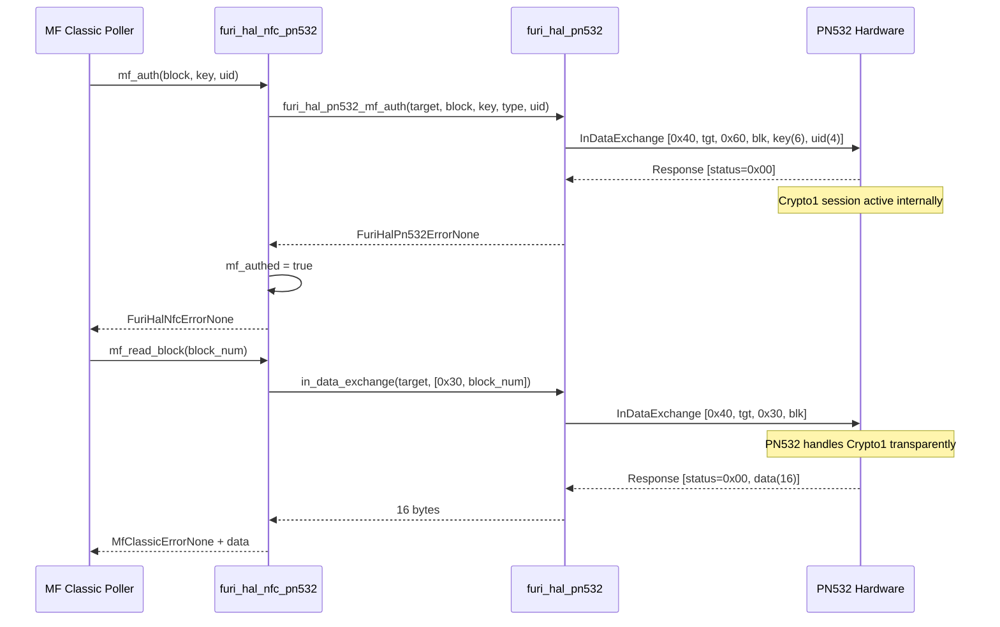
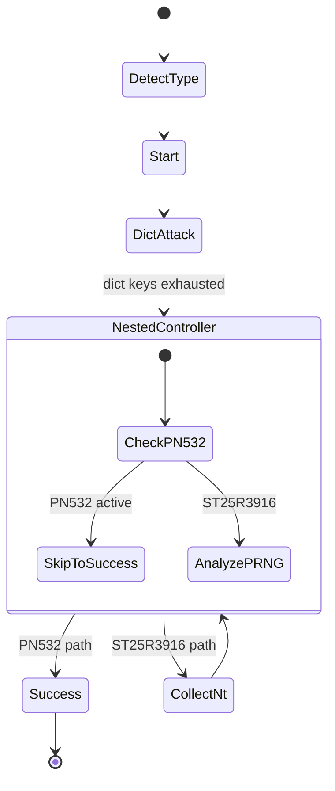
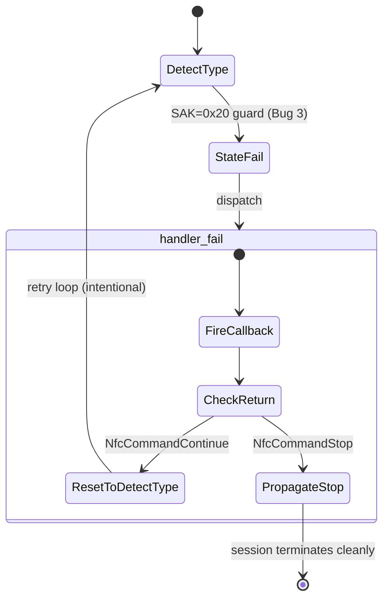

# Design Document: NFC Read Bugfix (PN532 MIFARE Classic)

## Overview

This design addresses three interrelated bugs that prevent reliable MIFARE Classic card reading on the DIY Flipper Zero's PN532 NFC backend. Bug 1 fixes authentication state tracking by using the PN532's native `InDataExchange` auth command. Bug 2 prevents an infinite loop by skipping the nested key-recovery attack on PN532. Bug 3 adds a SAK bit-mask guard to reject ISO-DEP-only cards from the MF Classic detection path.

## Glossary

- **PN532**: NXP NFC controller IC connected via I2C at address 0x48
- **InDataExchange**: PN532 command (0x40) that handles protocol framing and Crypto1 internally
- **InCommunicateThru**: PN532 command (0x42) that passes raw frames without protocol awareness
- **Crypto1**: MIFARE Classic proprietary encryption cipher
- **SAK**: Select Acknowledge byte returned by ISO14443-3A cards during anti-collision
- **ISO-DEP**: ISO14443-4 transport protocol, indicated by SAK bit 6 (0x20)
- **Nested attack**: Key recovery technique exploiting PRNG weaknesses in MIFARE Classic

## Bug Details

### Bug 1: PN532 Auth/Read State Mismatch

**Symptom**: After successful MIFARE Classic authentication, all block reads fail with PN532 status error 0x06. The `mf_authed` flag is cleared and all further reads abort.

**Root Cause**: The PN532 only tracks Crypto1 encryption state when authentication is performed through `InDataExchange` (0x40). If auth were done via `InCommunicateThru` (0x42, raw frame passthrough), the PN532 would not know a Crypto1 session is active, causing subsequent `InDataExchange` reads to fail because the chip cannot decrypt/encrypt the MIFARE protocol frames.

**Affected Code**: `furi_hal_pn532_mf_auth()` in `targets/f7/furi_hal/furi_hal_pn532.c` and `furi_hal_nfc_pn532_mf_auth()` in `targets/f7/furi_hal/furi_hal_nfc_pn532.c`

### Bug 2: Infinite Loop in Nested Attack on PN532

**Symptom**: After dictionary attack completes with at least one key found, the UI freezes on "Reading MIFARE Classic" screen. The state machine loops indefinitely.

**Root Cause**: `mf_classic_poller_get_nt()` uses `InCommunicateThru` for raw auth to collect nonces. On PN532, this always fails because the chip cannot perform raw MIFARE auth via passthrough. The state machine loops between `NestedCollectNt` → `NestedController` → `NestedCollectNt` without ever reaching a terminal state.

**Affected Code**: `mf_classic_poller_handler_nested_controller()` in `lib/nfc/protocols/mf_classic/mf_classic_poller.c`

### Bug 3: False MF Classic Detection of ISO-DEP Cards

**Symptom**: Bank cards and transit cards (SAK=0x20) are incorrectly classified as MIFARE Classic 1K, leading to failed authentication attempts.

**Root Cause**: The `detect_type` fallback path assumes any unrecognized ATQA/SAK combination is MF Classic 1K. Cards with SAK=0x20 (ISO-DEP only) have no MF Classic capability but fall through to the default case.

**Affected Code**: `mf_classic_poller_handler_detect_type()` in `lib/nfc/protocols/mf_classic/mf_classic_poller.c`

## Expected Behavior

1. **Bug 1**: After successful PN532 native auth via `InDataExchange`, subsequent block reads via `InDataExchange` return 16 bytes of data without error, maintaining the authenticated session for the entire sector.

2. **Bug 2**: On PN532 backends, the nested attack phase is skipped entirely after dictionary attack completes. The state machine transitions directly to success with whatever keys were found. No UI freeze occurs.

3. **Bug 3**: Cards with SAK bit 6 set (0x20) and no MF Classic bits (0x08 or 0x18) are rejected from the MF Classic read flow. Dual-interface cards (SAK=0x28, 0x38) continue to be correctly detected.

## Hypothesized Root Cause

### Bug 1: Protocol Command Mismatch

The PN532 has two distinct command paths for communicating with a target:
- **InDataExchange (0x40)**: The PN532 manages protocol state (Crypto1, CRC, framing) internally
- **InCommunicateThru (0x42)**: Raw frame passthrough with no protocol awareness

When auth uses `InDataExchange`, the PN532 internally activates Crypto1 for subsequent `InDataExchange` operations. The read/write functions already use `InDataExchange`, so they work correctly once auth is done through the same command path.

### Bug 2: Missing Hardware Capability Guard

The nested attack requires raw Crypto1 nonce collection with precise timing — a capability the PN532 does not expose through its command interface. Without a guard, the code attempts an operation that will always fail, creating an infinite retry loop.

### Bug 3: Overly Permissive SAK Fallback

The SAK byte encodes card capabilities via specific bit positions. The fallback logic doesn't check whether the card actually has MF Classic capability before defaulting to 1K classification.

## Fix Implementation

### Bug 1 Fix: Verify InDataExchange Auth Path

The `furi_hal_pn532_mf_auth()` function already correctly uses `InDataExchange`:

```c
// targets/f7/furi_hal/furi_hal_pn532.c (existing, verified correct)
FuriHalPn532Error furi_hal_pn532_mf_auth(
    uint8_t target_number,
    uint8_t block_num,
    const uint8_t* key,
    uint8_t key_type,
    const uint8_t* uid,
    uint8_t uid_len) {

    uint8_t cmd[14];
    cmd[0] = PN532_CMD_IN_DATA_EXCHANGE;  // 0x40 — native auth
    cmd[1] = target_number;
    cmd[2] = key_type ? 0x61 : 0x60;     // AUTH_A or AUTH_B
    cmd[3] = block_num;
    memcpy(&cmd[4], key, 6);              // 6-byte key
    memcpy(&cmd[10], uid, 4);             // last 4 bytes of UID
    // ... pn532_exchange() ...
}
```

The wrapper in `furi_hal_nfc_pn532.c` sets `mf_authed = true` on success:

```c
// targets/f7/furi_hal/furi_hal_nfc_pn532.c (existing, verified correct)
FuriHalNfcError furi_hal_nfc_pn532_mf_auth(...) {
    FuriHalPn532Error err = furi_hal_pn532_mf_auth(
        furi_hal_nfc_pn532.target.target_number, block_num, key, key_type, uid, uid_len);
    if(err == FuriHalPn532ErrorNone) {
        furi_hal_nfc_pn532.mf_authed = true;
        return FuriHalNfcErrorNone;
    }
    furi_hal_nfc_pn532.mf_authed = false;
    return FuriHalNfcErrorCommunication;
}
```

**Action**: Verify this path is correctly wired from the poller layer. The `mf_classic_poller_auth_native()` in `mf_classic_poller_i.c` must call `furi_hal_nfc_pn532_mf_auth()` when PN532 is active, and the `pn532_mf_authed` flag must be checked in `mf_classic_poller_read_block()`.

### Bug 2 Fix: PN532 Guard in Nested Controller

Add early return at the top of `mf_classic_poller_handler_nested_controller()`:

```c
// lib/nfc/protocols/mf_classic/mf_classic_poller.c
NfcCommand mf_classic_poller_handler_nested_controller(MfClassicPoller* instance) {
    // PN532 cannot perform nested attack (no raw Crypto1 timing support).
    // Skip directly to success with whatever keys the dictionary attack found.
    if(furi_hal_nfc_pn532_is_active()) {
        FURI_LOG_I(TAG, "PN532: skipping nested attack (unsupported)");
        instance->state = MfClassicPollerStateSuccess;
        return NfcCommandContinue;
    }

    // ... existing nested controller logic unchanged ...
}
```

### Bug 3 Fix: SAK Bit 6 Guard in detect_type

Insert guard before the SAK fallback in `mf_classic_poller_handler_detect_type()`:

```c
// lib/nfc/protocols/mf_classic/mf_classic_poller.c
if(!type_detected) {
    // Guard: Reject cards with ISO-DEP (bit 6) but no MF Classic bits (0x08 or 0x10)
    if((sak & 0x20) && !(sak & 0x18)) {
        FURI_LOG_D(TAG, "SAK 0x%02X: ISO-DEP only, not MF Classic", sak);
        instance->state = MfClassicPollerStateFail;
        return command;
    }

    // Existing fallback logic
    if(sak == 0x18 || sak == 0x88) {
        instance->data->type = MfClassicType4k;
    } else if(sak == 0x09 || sak == 0x89) {
        instance->data->type = MfClassicTypeMini;
    } else {
        instance->data->type = MfClassicType1k;
    }
    type_detected = true;
}
```

### Sequence Diagram: Auth + Read Flow (Bug 1)



### State Machine: Nested Attack Skip (Bug 2)



### SAK Guard Truth Table (Bug 3)

| SAK | Bit 6 (0x20) | Bits 4-3 (0x18) | Guard rejects? | Card type |
|-----|:---:|:---:|:---:|---------|
| 0x20 | ✓ | 0x00 | **YES** | ISO-DEP only (bank card) |
| 0x60 | ✓ | 0x00 | **YES** | ISO-DEP only |
| 0x28 | ✓ | 0x08 | NO | Dual: ISO-DEP + MF Classic 1K |
| 0x38 | ✓ | 0x18 | NO | Dual: ISO-DEP + MF Classic 4K |
| 0x08 | ✗ | 0x08 | NO | MF Classic 1K |
| 0x18 | ✗ | 0x18 | NO | MF Classic 4K |
| 0x09 | ✗ | 0x00 | NO | MF Classic Mini (no bit 6) |
| 0x01 | ✗ | 0x00 | NO | Unknown, fallback to 1K |

## Testing Strategy

### Unit Tests

1. **Auth path verification**: Mock PN532 I2C responses to confirm `InDataExchange` command byte (0x40) is sent with correct payload format `[tgt, 0x60/0x61, blk, key(6), uid(4)]`
2. **Read after auth**: Confirm `mf_read_block` succeeds when `mf_authed == true` and PN532 returns valid 16-byte response
3. **SAK guard**: Test all SAK values from the truth table above

### Integration Tests

1. Present a real MIFARE Classic 1K card → verify full sector read completes
2. Present a bank card (SAK=0x20) → verify it is rejected without hanging
3. Run dictionary attack to completion on PN532 → verify no UI freeze after dict phase

### Regression Tests

1. ST25R3916 nested attack path unchanged (mock `furi_hal_nfc_pn532_is_active()` → false)
2. Dual-interface cards (SAK=0x28) still detected as MF Classic
3. Manual Crypto1 path (`pn532_mf_authed == false`) still works for fallback scenarios

## Correctness Properties

*A property is a characteristic or behavior that should hold true across all valid executions of a system.*

### Property 1: Auth-then-read consistency

*For any* valid MIFARE Classic sector key and block number within that sector, if `furi_hal_pn532_mf_auth()` returns success, then a subsequent `furi_hal_nfc_pn532_mf_read_block()` for any block in that sector SHALL return 16 bytes of data without error.

**Validates: Requirements 2.1**

### Property 2: PN532 nested attack termination

*For any* MF Classic card read session on a PN532 backend, the state machine SHALL reach either `MfClassicPollerStateSuccess` or `MfClassicPollerStateFail` within a bounded number of state transitions (no infinite loops).

**Validates: Requirements 2.2**

### Property 3: SAK guard correctness

*For any* SAK value where bit 6 is set (SAK & 0x20 != 0) AND no MF Classic bits are set (SAK & 0x18 == 0), the `detect_type` handler SHALL transition to `MfClassicPollerStateFail` and NOT classify the card as MF Classic.

**Validates: Requirements 2.3**

### Property 4: Dual-interface card acceptance

*For any* SAK value where both bit 6 (0x20) AND at least one MF Classic bit (0x08 or 0x10) are set, the `detect_type` handler SHALL correctly classify the card as MF Classic (1K or 4K based on the MF Classic bits).

**Validates: Requirements 3.4**

### Property 5: ST25R3916 nested attack preservation

*For any* NFC session where `furi_hal_nfc_pn532_is_active()` returns false, the `nested_controller` handler SHALL proceed with the full nested attack logic without modification.

**Validates: Requirements 3.2**

### Property 6: Auth failure does not corrupt state

*For any* failed authentication attempt (wrong key, removed card), `mf_authed` SHALL be set to false, and subsequent read/write calls SHALL return an error without attempting I2C communication to the PN532.

**Validates: Requirements 2.1, 3.1**

---

## Bug 4: Infinite Loop in fail handler after SAK=0x20 rejection

### Bug Detail

**Symptom**: After the Bug 3 SAK=0x20 guard fires and sets `instance->state = MfClassicPollerStateFail`, the state machine calls `mf_classic_poller_handler_fail()`. That handler fires the `MfClassicPollerEventTypeFail` callback, receives `NfcCommandContinue` from the upper layer, then unconditionally resets `instance->state = MfClassicPollerStateDetectType`. The state machine re-enters `detect_type`, the SAK=0x20 guard fires again, and the loop repeats indefinitely.

**Root Cause**: `mf_classic_poller_handler_fail()` does not inspect the callback's return value before resetting state. The reset is unconditional, so even when the callback signals `NfcCommandStop` (terminal failure), the state machine ignores that signal and restarts the detection cycle.

**Affected Code**: `mf_classic_poller_handler_fail()` in `lib/nfc/protocols/mf_classic/mf_classic_poller.c`

### Fix Implementation

Condition the state reset on the callback's return value:

```c
// lib/nfc/protocols/mf_classic/mf_classic_poller.c

// BEFORE (buggy):
NfcCommand mf_classic_poller_handler_fail(MfClassicPoller* instance) {
    NfcCommand command = NfcCommandContinue;
    instance->mfc_event.type = MfClassicPollerEventTypeFail;
    command = instance->callback(instance->general_event, instance->context);
    instance->state = MfClassicPollerStateDetectType;  // BUG: unconditional reset
    return command;
}

// AFTER (fixed):
NfcCommand mf_classic_poller_handler_fail(MfClassicPoller* instance) {
    NfcCommand command = NfcCommandContinue;
    instance->mfc_event.type = MfClassicPollerEventTypeFail;
    command = instance->callback(instance->general_event, instance->context);
    if(command == NfcCommandContinue) {
        instance->state = MfClassicPollerStateDetectType;  // only reset if retrying
    }
    return command;
}
```

**Why this works**: When the SAK=0x20 guard (Bug 3) sets `StateFail` and the NFC framework's upper layer receives `MfClassicPollerEventTypeFail`, it returns `NfcCommandStop` to signal that polling should terminate. The fixed handler propagates that `NfcCommandStop` upward without resetting state, so the NFC framework tears down the session cleanly. The `NfcCommandContinue` branch is preserved for callers that genuinely want to retry (e.g., transient auth failures where the upper layer wants another attempt).

### Interaction with Bug 3

The two bugs form a compound failure:

1. Bug 3 guard fires → `instance->state = MfClassicPollerStateFail`
2. State machine dispatches to `handler_fail`
3. `handler_fail` fires callback → upper layer returns `NfcCommandStop`
4. **Bug 4 (unfixed)**: state reset to `DetectType` ignores the `Stop` → loop
5. **Bug 4 (fixed)**: `NfcCommandStop` skips the reset → session terminates

Without Bug 4's fix, Bug 3's fix alone is insufficient — the SAK guard correctly rejects the card but the fail handler immediately undoes that rejection by restarting detection.

### State Machine: Fail Handler Decision (Bug 4)



### Testing Strategy (Bug 4)

**Unit Tests**:
1. Call `handler_fail` with a mock callback returning `NfcCommandStop` → verify `instance->state` is unchanged and return value is `NfcCommandStop`
2. Call `handler_fail` with a mock callback returning `NfcCommandContinue` → verify `instance->state == MfClassicPollerStateDetectType` and return value is `NfcCommandContinue`
3. End-to-end: present SAK=0x20 card → verify state machine terminates (does not loop)

**Regression Tests**:
1. Transient auth failure scenario: upper layer returns `NfcCommandContinue` → retry loop still works
2. Bug 3 + Bug 4 combined: SAK=0x20 card → no infinite loop, clean `NfcCommandStop` propagation

### Correctness Properties (Bug 4)

**Prework reflection**: Requirements 4.2 and 4.3 both describe the Stop path; they are the same property. Requirements 4.4 and 4.5 both describe the Continue path; they are the same property. Two distinct properties remain after consolidation.

### Property 7: Fail handler respects NfcCommandStop

*For any* `MfClassicPoller` instance in any state, when `mf_classic_poller_handler_fail()` is called and the registered callback returns `NfcCommandStop`, the handler SHALL return `NfcCommandStop` and SHALL NOT modify `instance->state`.

**Validates: Requirements 4.2, 4.3**

### Property 8: Fail handler resets state on NfcCommandContinue

*For any* `MfClassicPoller` instance in any state, when `mf_classic_poller_handler_fail()` is called and the registered callback returns `NfcCommandContinue`, the handler SHALL set `instance->state = MfClassicPollerStateDetectType` and SHALL return `NfcCommandContinue`.

**Validates: Requirements 4.4, 4.5**
