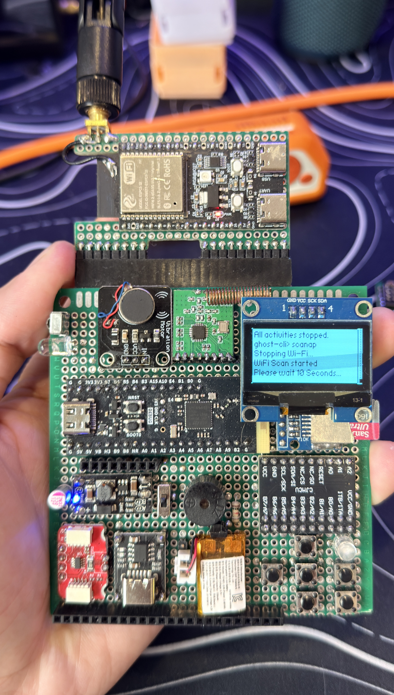

# ⚙️ DIY Flipper Zero

> WARNING: I do not take responsibility if you damage your board or property. This guide is for educational purposes only — proceed at your own risk.

---

## 📚 Table of contents
- [⚙️ DIY Flipper Zero](#️-diy-flipper-zero)
  - [📚 Table of contents](#-table-of-contents)
  - [Summary](#summary)
  - [What works / Limitations](#what-works--limitations)
  - [Key pins \& wiring (quick reference)](#key-pins--wiring-quick-reference)
  - [PCF8574 — Buttons, vibro and buzzer wiring guide](#pcf8574--buttons-vibro-and-buzzer-wiring-guide)
    - [Button-to-PCF mapping (from firmware)](#button-to-pcf-mapping-from-firmware)
  - [How to flash (OTP + firmware)](#how-to-flash-otp--firmware)
  - [Notes \& tips](#notes--tips)
  - [Credits](#credits)
  - [Currently busy with a high-priority production release: baby\_v1.0 🧑‍🍼](#currently-busy-with-a-high-priority-production-release-baby_v10-)
  - [☕ Support this project](#-support-this-project)

## Summary
This target implements a Flipper-style board based on the `STM32WB55CGU6` and integrates the following external hardware:

- 
- 
<em>Figure 1 — Prototyp</em>

- ✅ I2C OLED display (SH1106 / SSD1306)
- ✅ PCF8574 (I/O expander for buttons + buzzer/vibro control lines)
- ✅ microSD (SPI)
- ✅ CC1101 sub-GHz module
- ✅ Buttons (handled via PCF8574)
- ✅ Speaker / buzzer (via PCF8574 output line)
- ✅ IR RX/TX
- ✅ Vibration motor (via PCF8574 output line)
- ✅ Li-ion battery + optional 3.7→5V boost

## What works / Limitations
- ✅ Most official Flipper features are implemented.
- ✅ I2C: PCF8574, PN532, OLED (I2C preferred to free SPI).
- ✅ IR (RX/TX) and speaker/vibro outputs work.
- ✅ PCF8574 handles buttons and auxiliary outputs.
- ✅ SD card over SPI is supported (CS on PA10).

- ✅ NFC/RFID HAL path now initializes PN532 over I2C (address `0x24`) before NFC HAL startup.

## Key pins & wiring (quick reference)
Important: these macros are defined in `furi_hal_resources.*` and are used across the HAL code.

| Component | Bus / Interface | MCU pin (macro) | Notes |
|---|---:|---|---|
| I2C (power/default, I2C1) | I2C1 | SCL: PA9 (`I2C_1_SCL_GPIO_Port`/`I2C_1_SCL_Pin`) SDA: PB9 (`I2C_1_SDA_GPIO_Port`/`I2C_1_SDA_Pin`) | Used by OLED, PCF8574 (`0x20`) and PN532 (`0x24`) |
| I2C (external, I2C3) | I2C3 | SCL: PA7 (`I2C_3_SCL_GPIO_Port`/`I2C_3_SCL_Pin`) SDA: PB4 (`I2C_3_SDA_GPIO_Port`/`I2C_3_SDA_Pin`) | Useful for external I2C |
| SPI1 (shared) | SPI1 | MISO: PA6 (`SPI_MISO_Pin`), MOSI: PB5 (`SPI_MOSI_Pin`), SCK: PA5 (`SPI_SCK_Pin`) | Aligned with UBYTE STM32WB55CGU6 SPI1 alternate functions |
| CC1101 | SPI + IRQ | CS: PA15 (`CC1101_CS_Pin`), G0: PA1 (`CC1101_G0_Pin`) | Module IRQ on G0 |
| SD card | SPI | CS: PA10 (`SD_CS_Pin`) | SD on SPI; slow/fast presets available |
| PCF8574 | I2C | INT: PB0 (`MCP_INT_Pin`) | Address `0x20`; P0..P5 inputs, P6 vibro out, P7 buzzer out |
| IR | GPIO / ALT | RX: PA0 (`IR_RX_Pin`), TX: PA8 (`IR_TX_Pin`) | TX is IR LED drive — use proper resistor/transistor |
| Speaker/Buzzer | GPIO expander | PCF8574 P7 | Active-high digital output line |
| iButton | 1-Wire | PA3 (`iBTN_Pin`) | |
| PN532 NFC | I2C | I2C1 on PA9/PB9 | Address `0x24` (`PN532_I2C_ADDR_7BIT`) |
| UART | USART1 | TX: PB6, RX: PB7 | Debug / serial |
| USB | USB | DM/DP: PA11 / PA12 | USB lines handled by HAL init code |

See the canonical pin macros in [targets/f7/furi_hal/furi_hal_resources.h](targets/f7/furi_hal/furi_hal_resources.h).

## PCF8574 — Buttons, vibro and buzzer wiring guide
The PCF8574 I/O expander is used for button inputs and output control lines.

- Default I2C address: `0x20` (7-bit). The driver uses the power I2C bus (I2C1).
- Buttons are active-low (button to GND).

Known PCF8574 assignments used by HAL:

- P0..P5 — Buttons (Up, Down, Right, Left, OK, Back) via mapping in `applications/services/input/input.c`
- P6 — Vibro output (`PCF8574_PIN_VIBRO`)
- P7 — Buzzer output (`PCF8574_PIN_BUZZER`)

Example wiring recommendations
- Buttons: connect one side of each tactile switch to PCF8574 P0..P5 and the other side to GND.
- Vibro and buzzer: drive through transistor/MOSFET stages; do not drive motors or high-current buzzers directly from PCF8574.

Interrupt wiring
- Tie the PCF8574 INT pin to MCU `PB0` (`MCP_INT_Pin`) so EXTI notices button changes. HAL callback uses `furi_hal_pcf8574_attach_int()`.

Driver notes
- If PCF8574 is absent, boot continues but input/vibro/buzzer functions will not operate.

Safety
- Do not connect motors or high-current loads directly to PCF8574 pins. Use proper driver stages and add flyback protection where needed.

### Button-to-PCF mapping (from firmware)
The running firmware contains a default mapping array `pcf_pin_map_default` in
`applications/services/input/input.c`. The current mapping used by the HAL is:

| Logical key | Input index | PCF pin |
|---:|---:|---:|
| Up    | 0 | P0 |
| Down  | 1 | P1 |
| Right | 2 | P3 |
| Left  | 3 | P2 |
| OK    | 4 | P4 |
| Back  | 5 | P5 |

If your physical board uses only five buttons or a different wiring, update
the `applications/services/input/input.c` to match your wiring.

## How to flash (OTP + firmware)
Before you start
- This touches OTP (One-Time Programmable memory). Proceed with caution.
- Keep the PC powered and avoid USB disconnects.
- Install correct drivers; on Windows use Zadig to set USB Serial or WinUSB if needed.

Step 1 — Create OTP file
1. Open your OTP utility (e.g. `qFlipper OTP.exe`) (In the mics folder).
2. Fill fields (example): Version 12 | Firmware 7 | Body 9 | Connection 6
   - Display: `mgg` — Color: black/white/transparent — Region: `en_ru`/`us_ca_au`/`jp`/`world`
   - Name: up to 8 latin/number chars
3. Generate and save the file.

Step 2 — Write OTP (dangerous)
1. Hold `BOOT0` and plug the board into the PC.
2. Open `STM32CubeProgrammer`, choose `USB` connection and click `Connect`.
3. Select the generated OTP file and set Start Address: `0x1FFF7000`.
4. Click `Start Programming` and wait.

If the device disappears: retry drivers/ports or reinstall STM32CubeProgrammer.

Step 3 — Install firmware (qFlipper)
1. Remove microSD to avoid errors.
2. Open `qFlipper` with the board connected.
3. If not detected, use Zadig to install `USB Serial` / `WinUSB`.
4. Use `Install from file` and pick the `.dfu`.

## Notes & tips
- Use MOSFET/transistor drivers for motors and high-current loads. Add flyback diodes.
- Do not drive vibration motors or speakers directly from I/O without a transistor.
- Verify PCF8574 and PN532 I2C addresses if multiple devices share bus.
- If PN532 is not detected at boot, verify wiring and `0x24` address first.

## Credits
Thanks to Nucleus Dark for inspiring this project.

## Currently busy with a high-priority production release: baby_v1.0 🧑‍🍼

- This README was generated with the help of Copilot using a guided structure. I’ve reviewed it carefully, but you may still notice the occasional “robotic” sentence 😄  
- My baby needs his father, but I’ll always do my best to support this project. If you run into any issues, please feel free to open one.  
- If you find this project helpful, please consider supporting me and my growing family ❤️  

## ☕ Support this project
If this project helps you, please consider buying me a coffee:  

